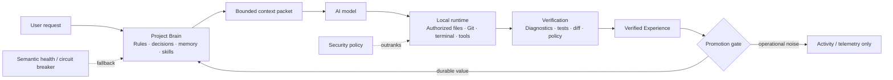

# How CodeLocal Works

## Mental model

CodeLocal separates four concerns that are often mixed together in AI coding tools:



Text fallback:

```text
AI model  ←→  Project Brain  ←→  Local runtime  →  Verification
                 ↑                                  |
                 └────── verified Experience ───────┘
```

The AI model can change. Project Brain is designed to preserve project continuity outside any single model or conversation.

## End-to-end request flow

```text
User request
   ↓
Identify project / repository / branch
   ↓
Resolve applicable rules + relevant knowledge + eligible skills
   ↓
Compile a small task-specific context packet
   ↓
AI model reasons about the task
   ↓
CodeLocal local runtime reads / edits / executes inside authorized boundaries
   ↓
Verification checks diagnostics, tests, policy and diff evidence
   ↓
Verified Experience
   ↓
Promotion rules decide whether anything is durable knowledge
   ↓
Future tasks can reuse the verified result
```

The important part is the final boundary: **an operation happening is not the same thing as knowledge worth remembering**.

## What Project Brain keeps

Examples of durable knowledge:

- an architecture decision;
- an important project constraint;
- a verified project fact;
- a repeated workflow that has passed verification;
- a project rule imported from supported project instructions;
- useful Experience from a completed task.

Examples of activity that should not become long-term knowledge by itself:

- “edited file X”;
- “ran tests”;
- “verification refreshed”;
- one transient tool failure;
- terminal progress;
- agent iteration logs.

This separation prevents the Brain from filling with operational noise.

## Canonical knowledge, graph and vectors

CodeLocal uses one canonical durable truth for Project Brain knowledge. Graph and vector representations are derived indexes.

```text
Canonical Knowledge
      ├── revisions + provenance
      ├── derived Knowledge Graph
      └── derived semantic/vector index
```

If a derived index is stale or unhealthy it can be rebuilt without losing the canonical knowledge history.

## Deterministic first, semantic when useful

CodeLocal does not use semantic search for everything.

Exact project identity, Git state, path scope, explicit rules and policy are resolved deterministically whenever possible.

Semantic retrieval is an optional ranking/retrieval lane. If its health degrades — for example errors, timeouts or repeated low-value results — a circuit breaker can stop using that lane and fall back to deterministic retrieval.

The user should get a useful result even when the semantic accelerator is unavailable.

## Cross-device project continuity

Local paths are not treated as the identity of a project.

```text
Machine A: /Users/alice/work/app
Machine B: D:\work\app
                       ↓
              same logical project
```

CodeLocal uses repository/project evidence and optional project markers to preserve continuity across machines, clones and worktrees while still keeping branch/repository applicability separate.

A project may also contain multiple repositories.

## Context stays bounded

A larger Brain should not produce a larger prompt forever.

CodeLocal resolves the task first, then compiles only a bounded packet such as:

```text
Must follow
- applicable project rules

Known facts
- a few current project facts/decisions

Reusable workflow
- one eligible verified skill, if relevant

Code
- only relevant symbols/ranges
```

The goal is less repeated rediscovery and fewer unnecessary model/tool round trips as the project matures.

## Learned Skills

A Learned Skill is a reusable workflow, not a permission grant.

A skill has context and verification requirements. If important project state changes, the workflow can become stale or require revalidation.

Cross-device skills are treated conservatively: a workflow learned elsewhere can be suggested/imported, but the receiving machine must still satisfy its own capability, context and security checks before normal reuse.

## Why verification matters

The AI saying “done” is not evidence.

CodeLocal keeps verification outside the model so a task can be judged using local diagnostics, tests, Git diff and project quality policy.

That evidence is also what makes future learning more trustworthy.
